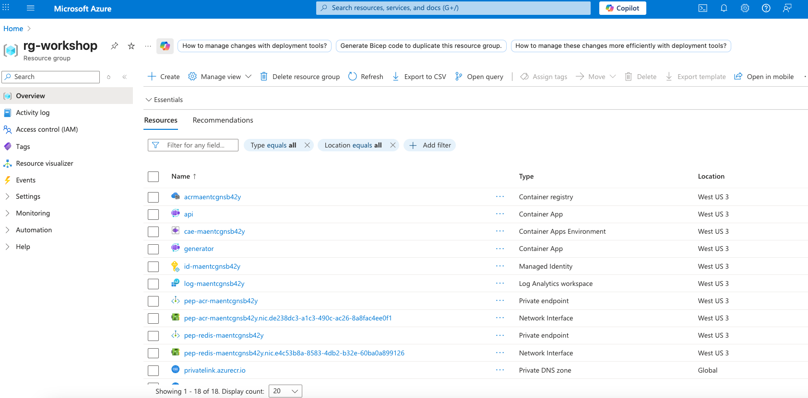
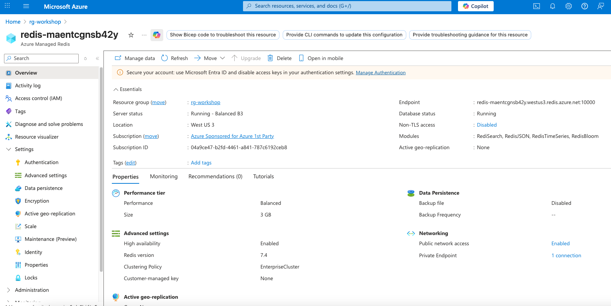
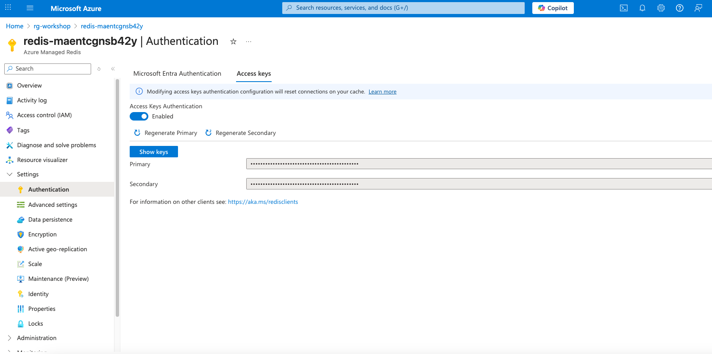
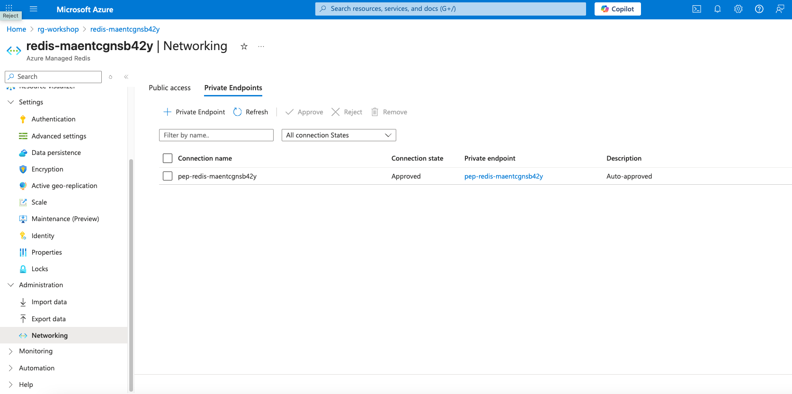
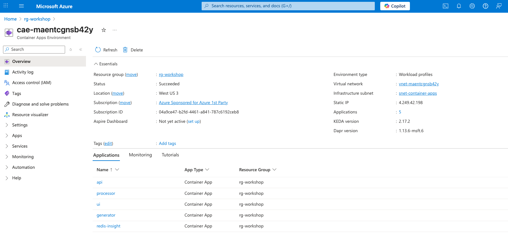
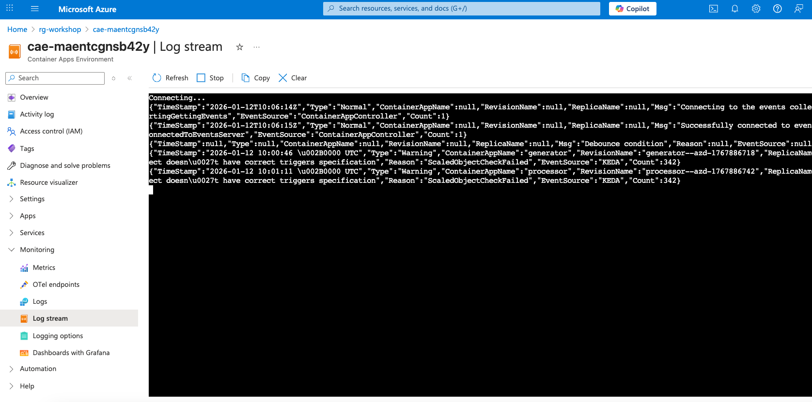
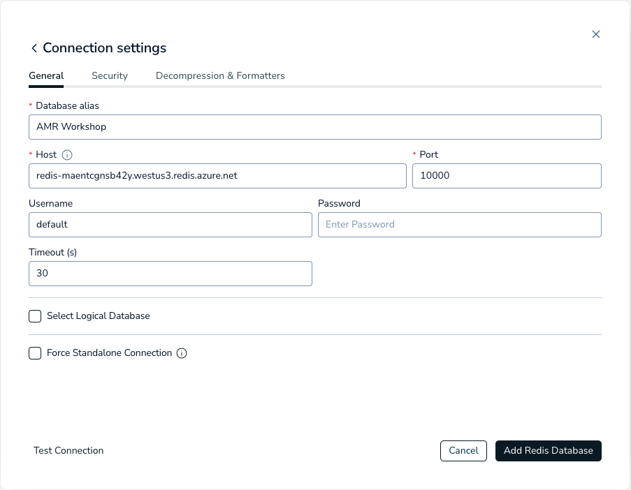
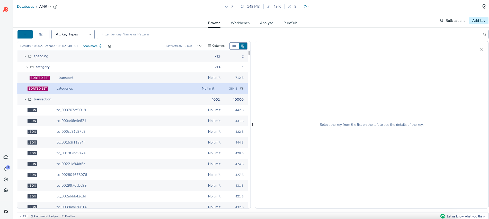

> **Tip:** For best viewing in your IDE, use markdown preview (VS Code: `Cmd+Shift+V` on Mac, `Ctrl+Shift+V` on Windows/Linux)

# Module 0: Explore Your Deployment in Azure Portal

Before writing code, let's explore what was deployed. This gives you context for the architecture you're building on.

---

## Step 1: Open Azure Portal

Go to [portal.azure.com](https://portal.azure.com)

---

## Step 2: Find Your Resource Group

1. Search **"Resource groups"** in the top search bar
2. Click your resource group: `rg-<your-environment-name>`

You'll see all deployed resources:



| Resource | Type | Purpose |
|----------|------|---------|
| `redis-*` | Azure Managed Redis | Your data store |
| `acr*` | Container Registry | Stores Docker images |
| `cae-*` | Container Apps Environment | Hosts your apps |
| `api`, `ui`, `processor`, `generator`, `redis-insight` | Container Apps | Your application services |
| `st*` | Storage Account | Azure Files for code sync |
| `log-*` | Log Analytics | Application logs |
| `vnet-*` | Virtual Network | Private networking |

---

## Step 3: Explore Azure Managed Redis

1. Click on the **`redis-*`** resource
2. Review the **Overview** blade:



| Setting | Value | Why |
|---------|-------|-----|
| **SKU** | Balanced B3 | Production-grade, 3GB memory |
| **Port** | 10000 | AMR uses non-standard port |
| **TLS** | Required | All connections encrypted |
| **Modules** | RediSearch, JSON, TimeSeries, Bloom | Pre-installed data structures |

### Key Sections to Explore

**Settings → Access keys**
- View your connection credentials
- Primary key used by applications



**Settings → Modules**
- See installed Redis modules
- These enable JSON, TimeSeries, Search capabilities


**Settings → Private endpoint connections**
- Redis is not publicly accessible
- Only Container Apps can reach it via VNet



---

## Step 4: Explore Container Apps

1. Go back to your Resource Group
2. Click on the **Container Apps Environment** (`cae-*`)



### Overview Blade
- **Application URL** — Public endpoint
- **Revision mode** — Single (one version running)
- **Status** — Running

### Key Sections

**Application → Containers**
- See the Docker image deployed
- Environment variables configured

**Application → Scale**
- Min/max replicas
- Currently set to 1 replica each

**Monitoring → Log stream**
- Real-time logs from the container
- Useful for debugging



---

## Step 5: Understand the Architecture

```
┌─────────────────────────────────────────────────────────────────┐
│                        Azure Container Apps                     │
│  ┌───────────┐  ┌───────────┐  ┌───────────┐  ┌───────────────┐ │
│  │    UI     │  │    API    │  │ Processor │  │   Generator   │ │
│  │  (React)  │  │ (FastAPI) │  │  (Python) │  │   (Python)    │ │
│  └─────┬─────┘  └─────┬─────┘  └─────┬─────┘  └───────┬───────┘ │
│        │              │              │                │         │
│        └──────────────┴──────────────┴────────────────┘         │
│                               │                                 │
│                    ┌──────────┴──────────┐                      │
│                    │   Private Endpoint  │                      │
│                    └──────────┬──────────┘                      │
└───────────────────────────────┼─────────────────────────────────┘
                                │
                    ┌───────────┴───────────┐
                    │  Azure Managed Redis  │
                    │  ┌─────────────────┐  │
                    │  │ • Streams       │  │
                    │  │ • Lists         │  │
                    │  │ • JSON          │  │
                    │  │ • Sorted Sets   │  │
                    │  │ • TimeSeries    │  │
                    │  │ • Vector Search │  │
                    │  └─────────────────┘  │
                    └───────────────────────┘
```

**Data Flow:**
1. **Generator** → Creates fake transactions → Writes to Redis Stream
2. **Processor** → Reads from Stream → Stores in various data structures (your code!)
3. **API** → Reads from Redis → Returns to UI
4. **UI** → Displays transactions, charts, search results

---

## Step 6: Open Redis Insight

Redis Insight lets you browse your Redis data directly.

### Get Connection Details

```bash
./show-redis-details.sh
```

Or on Windows:
```powershell
.\show-redis-details.ps1
```

### Connect in Redis Insight

1. Open your Redis Insight URL (shown after deployment)
2. Click **"Add Redis database"**
3. Enter:
   - **Host**: `redis-*.westus3.redis.azure.net`
   - **Port**: `10000`
   - **Username**: `default`
   - **Password**: (from show-redis-details output)
   - **Use TLS**: ✅ Enabled



4. Click **"Add Redis Database"**

### Explore Your Data

Once connected:
- **Browser** — See all keys
- **Streams** — View `transactions:stream`
- **Search** — Run queries against your data



*Your Redis is empty until transactions start flowing. Run the Generator to populate data.*

---

## ✅ Module 0 Complete

You now understand:
- What resources were deployed
- How Azure Managed Redis is configured
- The application architecture
- How to connect with Redis Insight

**Next:** [Module 1 — Ordered Transactions](../processor/README.md#module-1-ordered-transactions)
