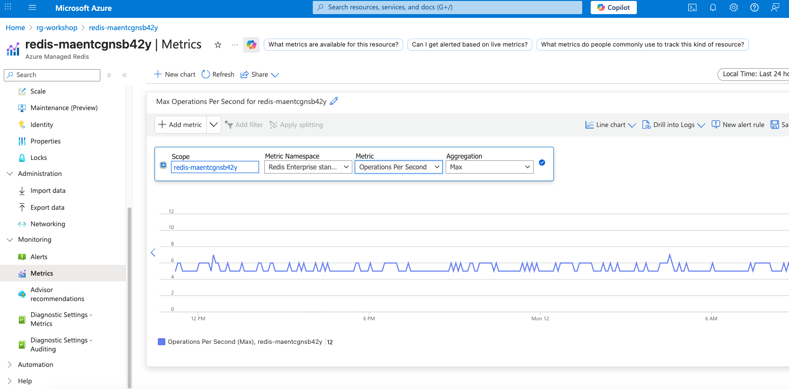
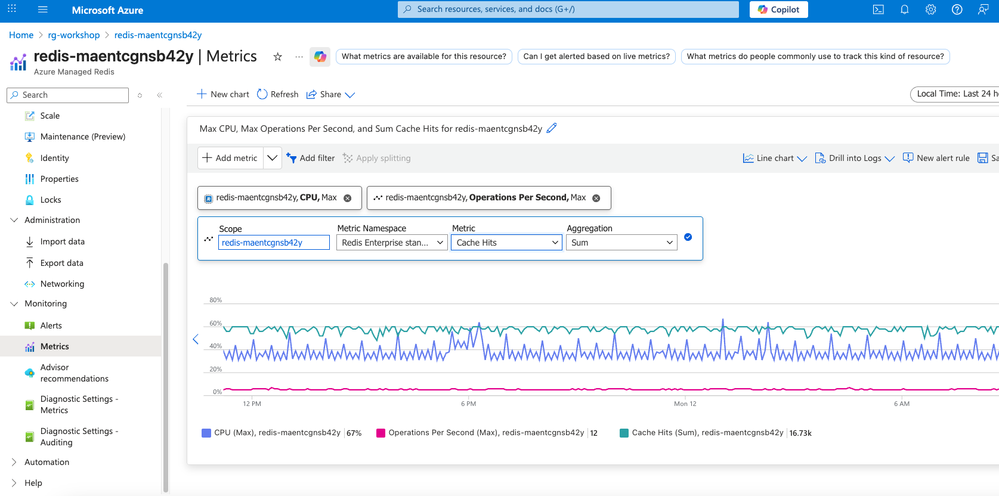
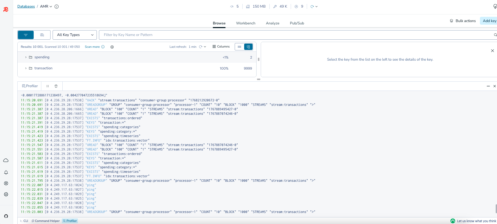
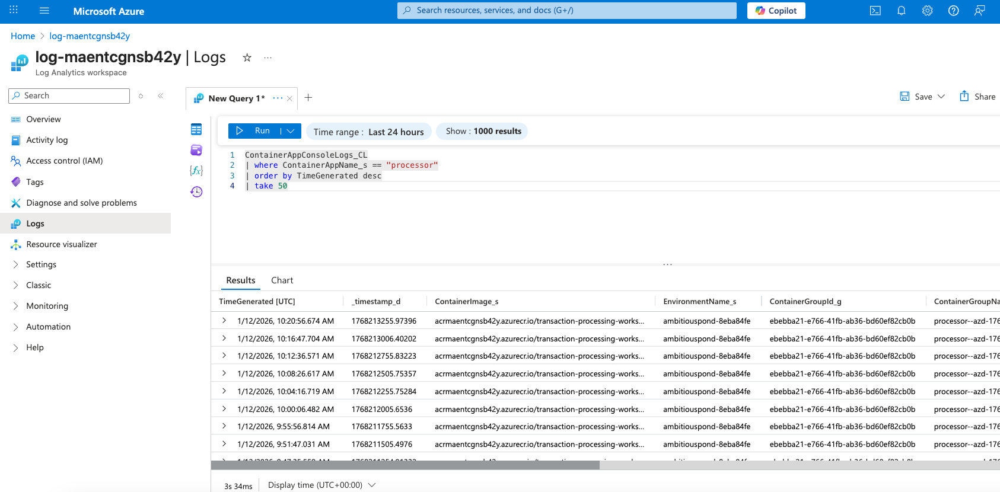
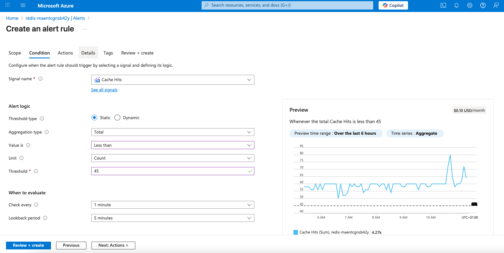
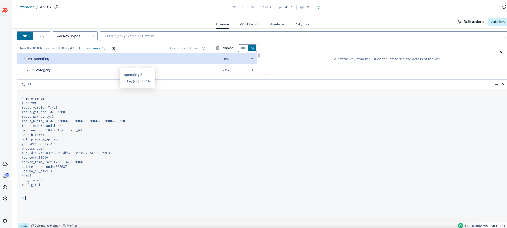

> **Tip:** For best viewing in your IDE, use markdown preview (VS Code: `Cmd+Shift+V` on Mac, `Ctrl+Shift+V` on Windows/Linux)

# Module 6: Observability with Azure Managed Redis

Monitor your Redis performance, track metrics, and set up alerts.

---

## Step 1: Open Redis Metrics

1. Go to [portal.azure.com](https://portal.azure.com)
2. Navigate to your Resource Group → **`redis-*`** (Azure Managed Redis)
3. Click **Monitoring → Metrics**

---

## Step 2: Key Metrics to Monitor

### Operations Per Second

1. Click **"Add metric"**
2. Select:
   - **Metric**: `Operations Per Second`
   - **Aggregation**: `Avg`



This shows how many Redis commands your application executes.

### Cache Latency

1. Click **"Add metric"**
2. Select:
   - **Metric**: `Cache Latency (Preview)`
   - **Aggregation**: `Avg`

Target: **< 1ms** for most operations. If higher, check your query patterns.

### Memory Usage

1. Click **"Add metric"**
2. Select:
   - **Metric**: `Used Memory`
   - **Aggregation**: `Max`

Your B3 instance has **3GB**. Monitor to avoid memory pressure.

### Connected Clients

1. Click **"Add metric"**
2. Select:
   - **Metric**: `Connected Clients`
   - **Aggregation**: `Max`

Shows how many connections are active (Processor, API, Generator, Redis Insight).

---

## Step 3: Create a Dashboard

Save your metrics for quick access:

1. Configure the metrics you want
2. Click **"Save to dashboard"** → **"Pin to dashboard"**
3. Choose **"Create new"** or existing dashboard
4. Name it: `Redis Workshop Monitoring`



Access anytime from **Dashboard** in the portal sidebar.

---

## Step 4: View Slow Commands (Redis Insight)

Redis Insight shows you which commands are slow.

1. Open Redis Insight (your deployed URL)
2. Connect to your database
3. Go to **Profiler** tab (bottom of screen)
4. Click **"Start Profiler"**
5. Interact with your UI — watch commands flow in real-time



Look for:
- Commands taking > 10ms
- Unexpected command patterns
- High-frequency operations

---

## Step 5: Monitor Container Apps

Your Redis clients run in Container Apps. Monitor them too.

### View Application Logs

1. Go to your Resource Group
2. Click on **`processor`** Container App
3. Go to **Monitoring → Log stream**

Watch real-time processing logs:
```
Processing transaction: tx_abc123
Stored in JSON: transaction:tx_abc123
Added to ordered list
Updated spending categories
```

### Query Historical Logs

1. Go to **Log Analytics Workspace** (`log-*`) → **Logs**
2. Run a KQL query:

```kusto
ContainerAppConsoleLogs_CL
| where ContainerAppName_s == "processor"
| order by TimeGenerated desc
| take 50
```



This finds recent logs from your processor.

---

## Step 6: Set Up Alerts (Optional)

Get notified when something's wrong.

### High Memory Alert

1. Go to **`redis-*`** → **Monitoring → Alerts**
2. Click **"Create alert rule"**
3. Configure:
   - **Signal**: `Cache Hits` (or `Used Memory Percentage`)
   - **Operator**: `Less than` (or `Greater than`)
   - **Threshold**: Set based on your needs
   - **Frequency**: Every 1-5 minutes



4. Add an **Action group** (email, SMS, webhook)
5. Name: `Redis Alert`
6. Click **"Create"**

### High Latency Alert

Same process with:
- **Signal**: `Cache Latency`
- **Threshold**: `10` (milliseconds)

---

## Step 7: Check Redis INFO Stats

In Redis Insight, run these commands in the **CLI** tab:



### Memory Stats
```redis
INFO memory
```

Key values:
- `used_memory_human` — Current memory usage
- `maxmemory_human` — Memory limit
- `mem_fragmentation_ratio` — Should be ~1.0

### Client Stats
```redis
INFO clients
```

Key values:
- `connected_clients` — Active connections
- `blocked_clients` — Clients waiting on BLPOP etc.

### Command Stats
```redis
INFO commandstats
```

Shows call count and average latency per command. Find your hottest commands.

### Keyspace Stats
```redis
INFO keyspace
```

Shows key count per database. All your data is in `db0`.

---

## Quick Reference: Healthy Metrics

| Metric | Healthy Range | Action if Exceeded |
|--------|--------------|-------------------|
| **Operations/sec** | < 10,000 for B3 | Scale up or optimize queries |
| **Latency** | < 1ms avg | Check slow commands, network |
| **Memory** | < 80% | Add TTL to keys, scale up |
| **Connected Clients** | < 100 | Check for connection leaks |
| **Cache Hit Ratio** | > 90% | Review access patterns |

---

## ✅ Module 6 Complete

You now know how to:
- Monitor Redis performance metrics
- Create dashboards for quick access
- Use Redis Insight Profiler
- Query Container App logs
- Set up alerts for issues
- Run INFO commands for diagnostics

**Congratulations!** You've completed the workshop. 🎉

---

## Clean Up

When done, delete all resources:

```bash
azd down
```

This removes:
- Azure Managed Redis
- All Container Apps
- Storage, networking, logs
- Everything in the resource group
